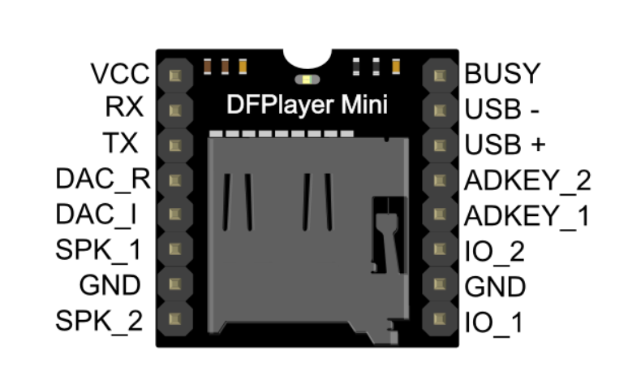
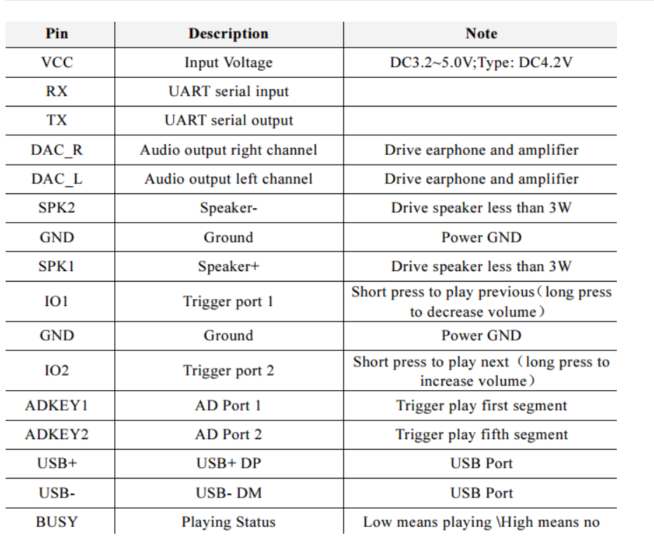
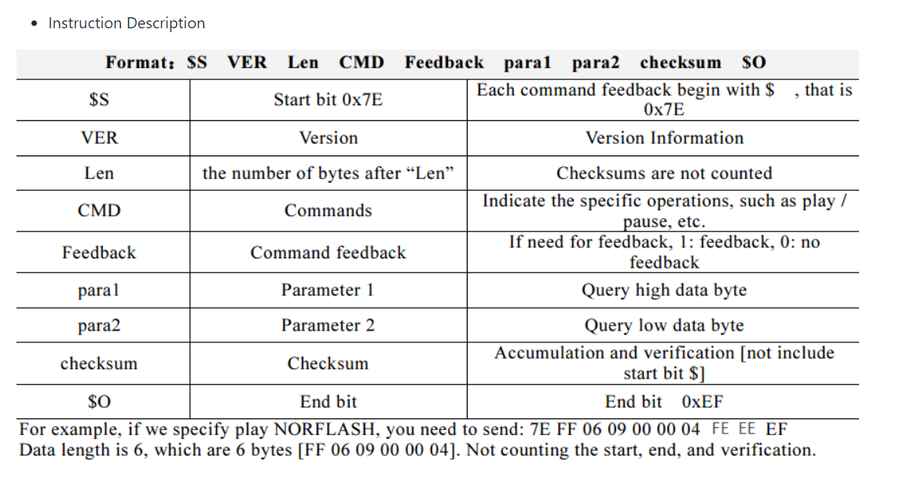

# PIC16F877a-with-DFPLAYER

Dự án này hướng dẫn cách kết nối vi điều khiển PIC16F877A với mô-đun MP3 DFPlayer Mini để tạo ra một máy nghe nhạc MP3 đơn giản. Vi điều khiển PIC16F877A điều khiển DFPlayer Mini, cho phép phát lại các tệp âm thanh được lưu trữ trên thẻ micro SD.

## Thành phần

- Vi điều khiển PIC16F877A
- Mô-đun MP3 DFPlayer Mini
- Thẻ micro SD
- Loa hoặc Tai nghe
- Nguồn cung cấp (5V cho DFPlayer Mini và PIC16F877A)
- Dây kết nối

## Mô-đun MP3 DFPlayer Mini
### Pin Map

### Serial Mode

## Sơ đồ mạch

Sơ đồ mạch sẽ chi tiết cách kết nối PIC16F877A với mô-đun MP3 DFPlayer Mini. Đảm bảo kết nối các chân TX và RX của DFPlayer với các chân RX và TX tương ứng của PIC16F877A để giao tiếp nối tiếp. Cung cấp điện cho các thành phần theo yêu cầu của chúng.

## Hướng dẫn thiết lập

1. **Chuẩn bị thẻ SD**: Tải các tệp MP3 vào cùng 1 folder.
2. **Lắp ráp mạch**: Lắp ráp mạch theo sơ đồ mạch.
    - Kết nối chân `TX` của DFPlayer Mini với chân `RX` của PIC16F877A.
    - Kết nối chân `RX` của DFPlayer Mini với chân `TX` của PIC16F877A.
    - Kết nối chân `VCC` và `GND` của DFPlayer Mini với nguồn cung cấp `5V`.
    - Kết nối chân `VCC` và `GND` của PIC16F877A với nguồn cung cấp `5V`.
    - Kết nối chân `BUSY` của DFPlayer Mini với chân `RB0` của PIC16F877A.
    - Kết nối chân `RESET` của DFPlayer Mini với chân `RB1` của PIC16F877A.
    - Kết nối chân `DAC_R` và `DAC_L` của DFPlayer Mini với `loa` hoặc `tai nghe`.

3. **Lập trình cho PIC16F877A**:
   - Sử dụng `MPLAB X IDE` để viết và nạp code và PIC16F877A.

## Kết luận

Sau khi hoàn thành các bước trên, bạn sẽ có một máy nghe nhạc MP3 đơn giản sử dụng vi điều khiển PIC16F877A và mô-đun MP3 DFPlayer Mini. Bạn có thể mở rộng dự án bằng cách thêm các chức năng khác như điều khiển từ xa, hiển thị LCD, v.v.